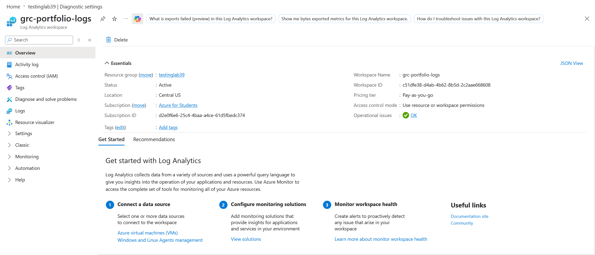
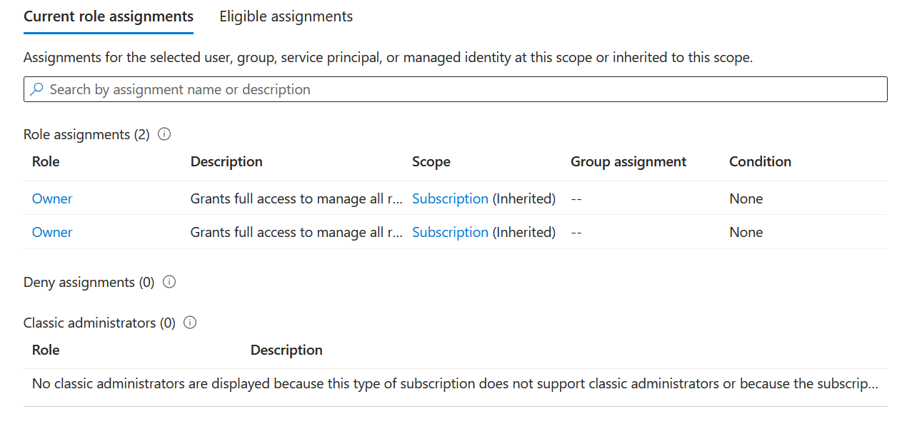
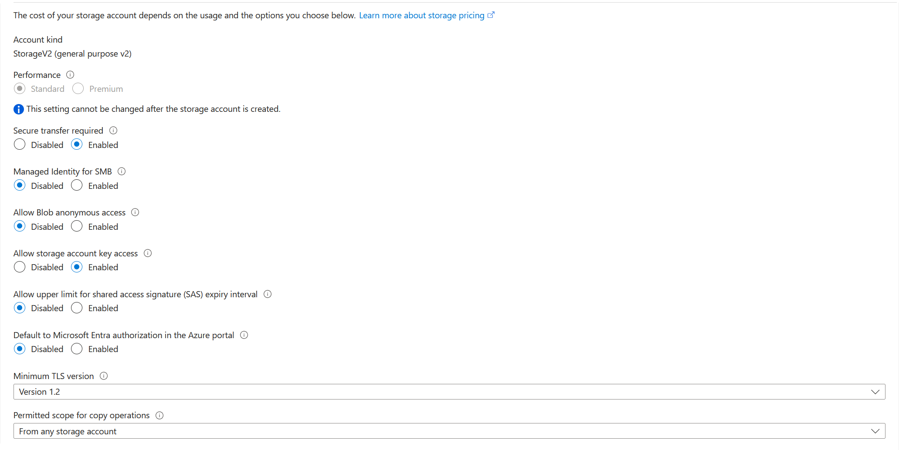
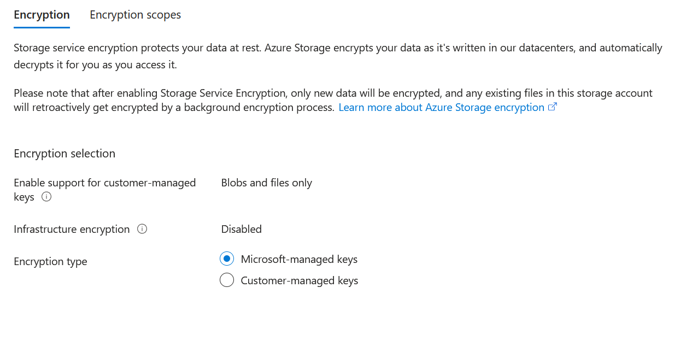

# Azure GRC Portfolio 
### Governance, Rish & Compliance Lab Series | Microsoft Azure

----

## About My Portfolio

I'm a cybersecurity student transitioning into Governance, Rish, and Compliance (GRC). This handcrafted portfolio documents labs I have built in Mircosoft Azure to demostrate practical skills in compliance framworks, identity managment, security posture, and threat detection.

My backgroud is in food service and various retail environments - industries where communication, accountability, and process adherence are everything. I'm bringing these soft skills into cybersecurity, with a focus on GRC roles where people, policy and technology traverse. 

**Target Roles:** Help Desk, IT Security Analyst, Compliance Analyst, Junior IT Auditor, Security Awareness Coordinator
**Target Market:** Chicagoland, and suburbs. Open to Remote or Hybrid Roles 

---

##Certifications In Progress

| Certification | Status |
|---|---|
| CompTIA Network+  | In Progress |
| CompTIA Security+ | In Progress |
| Microsoft AZ-900 (Azure Fundamentals) | In Progress |
| MIcrosoft AZ-500 (Azure Security Engineer) | Planned |


# 🛡️ Azure GRC Portfolio Project

> A hands-on Governance, Risk, and Compliance (GRC) lab built on Microsoft Azure, demonstrating real-world security controls, logging infrastructure, and identity management best practices.

---

## 📋 Table of Contents

- [Project Overview](#project-overview)
- [Technologies Used](#technologies-used)
- [Lab Components](#lab-components)
  - [1. Log Analytics Workspace](#1-log-analytics-workspace)
  - [2. Identity & Access Management (IAM)](#2-identity--access-management-iam)
  - [3. Storage Account Security](#3-storage-account-security)
  - [4. Storage Encryption](#4-storage-encryption)
- [Key Security Controls Implemented](#key-security-controls-implemented)
- [GRC Framework Alignment](#grc-framework-alignment)
- [Screenshots](#screenshots)
- [How to Replicate This Lab](#how-to-replicate-this-lab)
- [Lessons Learned](#lessons-learned)

---

## Project Overview

This project demonstrates foundational GRC capabilities in a cloud environment using Microsoft Azure. It covers the setup and configuration of centralized logging, identity governance, secure storage, and data encryption — all core pillars of a real-world compliance program.

The goal is to simulate how a security or GRC analyst would configure and document cloud infrastructure to meet common compliance frameworks such as NIST, CIS Benchmarks, and SOC 2.

---

## Technologies Used

| Technology | Purpose |
|---|---|
| Microsoft Azure | Cloud platform |
| Azure Log Analytics | Centralized log collection and monitoring |
| Azure IAM (RBAC) | Identity and access governance |
| Azure Storage Account | Secure data storage |
| Azure Monitor | Workspace health and alerting |

---

## Lab Components

### 1. Log Analytics Workspace

**Resource:** `grc-portfolio-logs`  
**Resource Group:** `testinglab39`  
**Location:** Central US  
**Pricing Tier:** Pay-as-you-go

A Log Analytics workspace was created to serve as the centralized logging hub for the environment. This enables:
- Collection of security events and telemetry from Azure resources
- Querying logs using Kusto Query Language (KQL)
- Integration with Azure Monitor for alerting on anomalous activity

> 

---

### 2. Identity & Access Management (IAM)

Role-Based Access Control (RBAC) was reviewed and documented at the subscription level. The current role assignments include:

- **Role:** Owner (x2)
- **Scope:** Subscription (Inherited)
- **Condition:** None

This documents the principle of least privilege review — identifying who has access, at what scope, and whether conditions or guardrails are applied.



---

### 3. Storage Account Security Configuration

A Storage Account (StorageV2 — General Purpose v2) was configured with the following security settings:

| Setting | Value |
|---|---|
| Performance | Standard |
| Secure transfer required | ✅ Enabled |
| Managed Identity for SMB | ❌ Disabled |
| Allow Blob anonymous access | ❌ Disabled |
| Allow storage account key access | ✅ Enabled |
| SAS expiry interval upper limit | ❌ Disabled |
| Default to Microsoft Entra authorization | ❌ Disabled |
| Minimum TLS version | Version 1.2 |
| Permitted scope for copy operations | From any storage account |

**Notable controls:**
- Anonymous blob access is **disabled** — preventing public data exposure
- Secure transfer is **required** — enforcing HTTPS/TLS in transit
- Minimum TLS 1.2 — rejecting outdated, vulnerable protocol versions

> 

---

### 4. Storage Encryption

Encryption at rest is configured using Azure's default Storage Service Encryption:

| Setting | Value |
|---|---|
| Customer-managed key support | Blobs and files only |
| Infrastructure encryption | ❌ Disabled |
| Encryption type | Microsoft-managed keys |

Data is automatically encrypted when written to Azure datacenters and decrypted on access. Microsoft-managed keys are used, providing platform-level encryption without additional key management overhead.



---

## Key Security Controls Implemented

- ✅ Centralized logging via Log Analytics
- ✅ RBAC role assignment documentation
- ✅ Encryption at rest for storage
- ✅ Encryption in transit (HTTPS required, TLS 1.2 minimum)
- ✅ Anonymous access disabled on blob storage
- ✅ Workspace operational health monitoring

---

## GRC Framework Alignment

| Control | NIST 800-53 | CIS Benchmark |
|---|---|---|
| Centralized logging | AU-2, AU-12 | CIS 8.2 |
| RBAC least privilege review | AC-6 | CIS 5.4 |
| Encryption at rest | SC-28 | CIS 3.11 |
| Encryption in transit | SC-8 | CIS 3.10 |
| Disabling anonymous access | AC-3 | CIS 7.1 |
| TLS 1.2 minimum | SC-8 | CIS 9.3 |

---

## Screenshots

Place your screenshots in a folder called `screenshots/` in the root of this repository. Then they will display here automatically.

```
grc-portfolio/
├── README.md
├── screenshots/
│   ├── log-analytics-overview.png
│   ├── iam-role-assignments.png
│   ├── storage-security-settings.png
│   └── storage-encryption.png
```

### Log Analytics Workspace Overview


### IAM Role Assignments


### Storage Account Security Settings


### Storage Encryption Configuration


---

## How to Replicate This Lab

1. **Create a Resource Group** in Azure Portal (e.g., `testinglab39`)
2. **Deploy a Log Analytics Workspace**
   - Search "Log Analytics workspaces" → Create
   - Set pricing tier to Pay-as-you-go
3. **Review IAM Role Assignments**
   - Navigate to your subscription → Access Control (IAM) → View role assignments
   - Document who has what access at which scope
4. **Create a Storage Account**
   - Search "Storage accounts" → Create
   - Under the **Advanced** tab, configure security settings as documented above
   - Under **Encryption**, review and document encryption type
5. **Document everything** — this README is your evidence artifact

---

## Things I learned: 

- Cloud environments require calculated configuration — insecure defaults exist and must be      actively addressed
- Documenting IAM assignments is a core GRC activity to support access reviews
- Logging infrastructure is the foundation. — without it, there is no visibility into what's really happening in your environment
- Even a student/lab Azure subscription can be used to demonstrate real world compliance controls

---

*This is my personal GRC portfolio. All resources are in a non-production Azure for Students subscription.*
